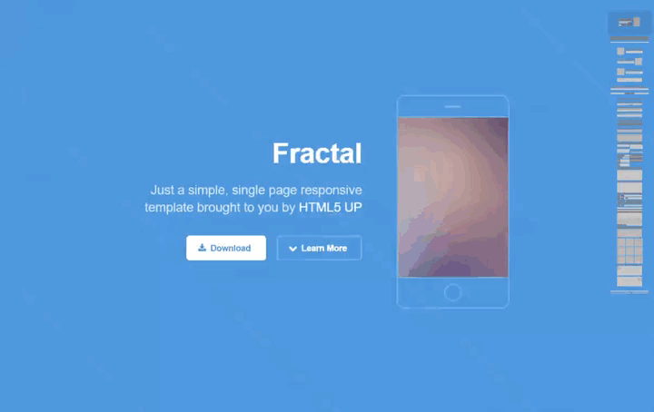

# A minimap for websites, a la Sublime Text
###### Xivmap comes both as a jQuery Plugin and as plain JS, using the same file.

[](http://mccxiv.github.io/xivmap/)

[Click for live demos](http://mccxiv.github.io/xivmap/)

## Setup

##### 1. Download xivmap with one of these methods:

```
bower install --save mccxiv/xivmap
```
```
npm install --save mccxiv/xivmap
```
```
Or download from: https://github.com/mccxiv/xivmap/releases
```

##### 2. Include xivmap in your page
```
<link rel="stylesheet" href="your/path/xivmap.css">
<script src="your/path/xivmap.js"></script>

<!-- in body -->
<div class="xivmap"></div>
```

##### 3. Run xivmap
```
xivmap();

// Or with jQuery
$('.xivmap').xivmap();
```

> Tip: wait for the load event to make sure images have been loaded and are the correct size

```
window.addEventListener('load', xivmap);
```

## Options and Methods

All config properties are optional, you may provide either CSS selectors or HTMLElements.  
The defaults are:
```
var map = xivmap({
	// This will contain the minimap.
	minimap: '.xivmap',

	// The minimap will be based on this element
	content: document.documentElement,

	// Array of CSS selectors that should be represented on the minimap
	selectors: xivmap.selectors()
});

// Forces the minimap to update
map.render();

// Empties the minimap container and cleans up listeners
map.destroy();
```

> Tip: Want to change which elements appear on the minimap? `xivmap.selectors()` provides a good starting point to modify and pass back into the `xivmap()` function

## Browser Support
Modern browsers and IE 9+.

## License
© 2015 Andrea Stella

Unfortunately, this is not free software.  
The source code is made available for educational purposes and for non commercial use.